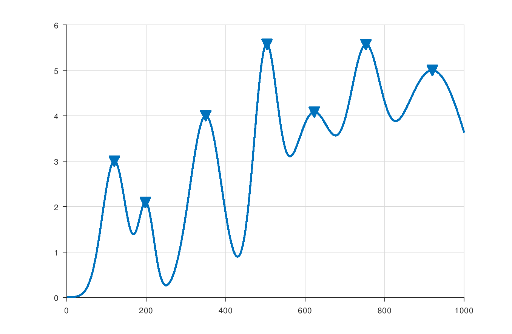
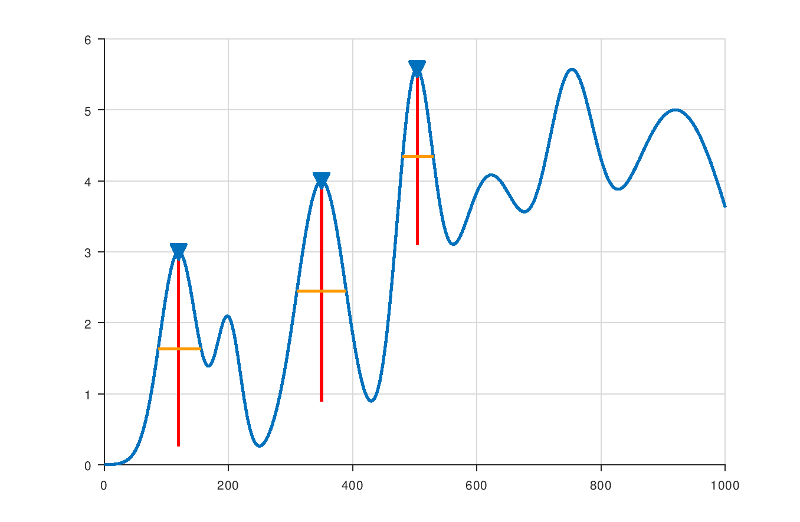

Octave Extensions
=================

This is a set of scripts and functions for
[GNU Octave](https://www.gnu.org/software/octave/) which provide various
functionality found to be missing in the standard packages.

Installation
============

From source
--------------------

Clone the repository and run `make install` from the project root.
This will build the package and install it into your Octave installation.

```sh
git clone https://github.com/Singond/Octave-extensions.git
cd Octave-extensions
make install
```

From pre-built package
-------------------------------

Pre-built packages for Octave are available at the
[releases page](https://github.com/Singond/Octave-extensions/releases).
You can use this method to only install the package without downloading
the whole repository:

1. From the `Assets` section in the desired version, find the file
   `singon-ext-*.tar.gz` (here `*` is the version number).
2. Copy the URL of the file.
3. In your Octave prompt, run ` pkg install '<url>'` where `<url>`
   is the URL of the file.

Usage
=====

Having installed the package, load it like any other package.
In your Octave prompt, run the following:

```sh
pkg load singon-ext
```

Examples
========

Finding peaks
-------------
The `findpeaksp` function searches for peaks in a signal. This implementation
supports filtering peaks by width and prominence.

The following example generates a simple signal, finds all peaks in the signal,
and displays the results in a plot:

```
## Generate an example signal by summing several gaussian pulses
x = 0.1:0.1:100;
p = [12 20 35 50 62 75 92];
s = [ 3  2  4  3  6  4 10];
m = [ 3  2  4  5  4  4  5];
yy = arrayfun(@(p,s,m) m*exp(-(x-p).^2./(2*s^2)), p, s, m, "UniformOutput", false);
y = sum(cell2mat(yy'))';

## Find all peaks in the signal and plot the results
findpeaksp(y);
```



A small modification to the above example allows one to select only the peaks
with prominence equal to or higher than 2:

```
## Generate an example signal by summing several gaussian pulses
x = 0.1:0.1:100;
p = [12 20 35 50 62 75 92];
s = [ 3  2  4  3  6  4 10];
m = [ 3  2  4  5  4  4  5];
yy = arrayfun(@(p,s,m) m*exp(-(x-p).^2./(2*s^2)), p, s, m, "UniformOutput", false);
y = sum(cell2mat(yy'))';

## Find peaks in the signal with prominence at least 2 and plot the results
findpeaksp(y, "MinPeakProminence", 2, "Annotate");
```



Here, we have used the `Annotate` option to mark the prominences in the plot.
